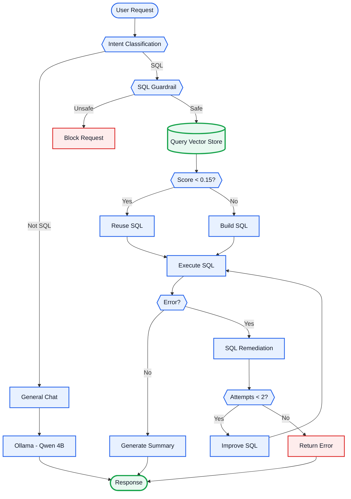

# 🤖 SQL AI Agent

An AI-powered SQL assistant that allows users to interact with databases using natural language.

Built with **LangGraph, Google Gemini, Ollama, Vector Store, Flask, and Streamlit**.

## ⭐ Key Feature — Query Vector Store

The agent stores previously generated **user request → SQL query** pairs in a vector store.

For every new SQL request, it searches for a similar query:

* **Score < 0.15** → Reuse the stored SQL
* **Score ≥ 0.15** → Generate a new SQL query

The similarity threshold is continuously evaluated and adjusted based on the results produced by the workflow to improve retrieval accuracy.

This helps reduce **LLM API calls, cost, and response time**.

## 🏗️ Workflow



## ✨ Features

* 🧠 Natural-language SQL generation
* 🗄️ Query Vector Store / SQL memory
* 🛡️ Read-only SQL guardrails
* 🔧 Automatic SQL error remediation
* 🔁 Up to 2 correction attempts
* 📝 Result summarization
* 🧵 Thread-based chat history
* 💬 General chat with Qwen 4B
* 🤖 SQL workflow with Google Gemini

## 🧩 Tech Stack

| Component    | Technology       |
| ------------ | ---------------- |
| Frontend     | Streamlit        |
| Backend      | Flask            |
| Agent        | LangGraph        |
| General Chat | Ollama / Qwen 4B |
| SQL LLM      | Google Gemini    |
| Query Memory | Vector Store     |
| Database     | SQL Database     |
| Language     | Python           |

## ⚙️ Setup

```bash
git clone <YOUR_REPOSITORY_URL>
cd <PROJECT_DIRECTORY>

python -m venv venv
venv\Scripts\activate

pip install -r requirements.txt
```

Create a `.env` file with your API and database credentials.

Install the Ollama model:

```bash
ollama pull qwen:4b
```

Run the backend:

```bash
python app.py
```

Run the frontend in another terminal:

```bash
streamlit run streamlit_app.py
```

## 👨‍💻 Author

**Vardhan Reddy**
