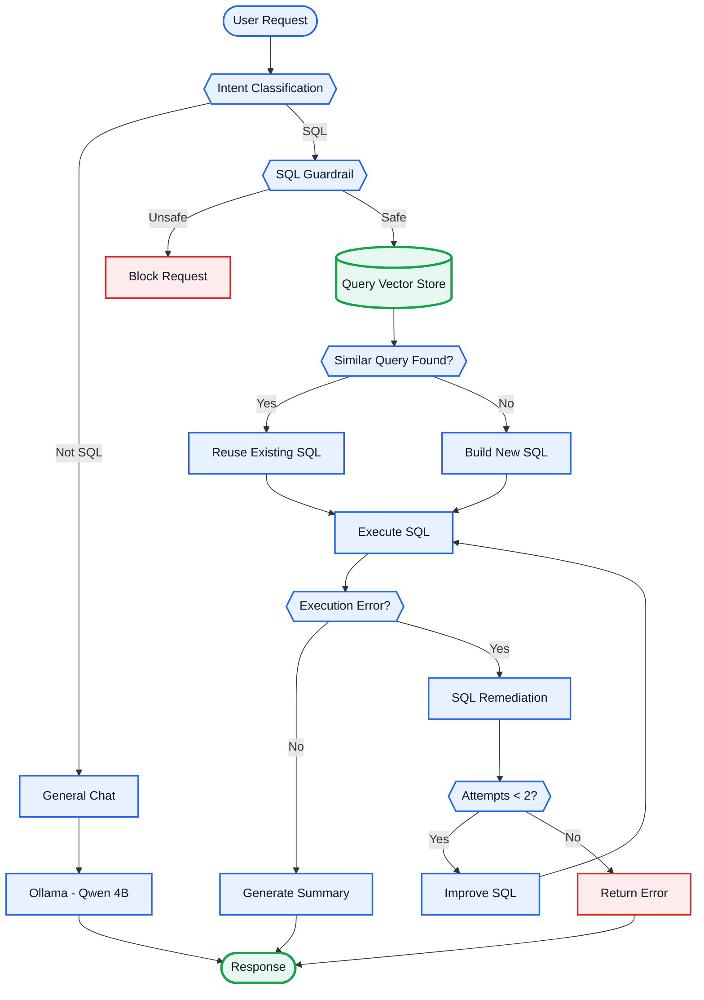

# 🤖 SQL AI Agent

An AI-powered SQL assistant that allows users to interact with databases using natural language.

Built with **LangGraph, Google Gemini, Ollama, Vector Store, Flask, and Streamlit**.

## ⭐ Key Feature — Query Vector Store

The core optimization of this project is a **Query Vector Store** that stores previously processed:

```text
User Request → Generated SQL Query
```

For every new SQL request, the agent searches the vector store for a semantically similar request.

If a sufficiently similar query is found, the stored SQL is reused. Otherwise, a new SQL query is generated using the LLM.

The retrieval threshold is **experimentally tuned based on the results produced by the workflow** and can be adjusted to improve retrieval accuracy.

This approach is designed to reduce unnecessary LLM calls and improve response time for repeated or similar requests.

## 🏗️ Workflow



## ✨ Features

* 🧠 Natural-language SQL generation
* 🗄️ Query Vector Store for SQL memory
* 📊 Similarity-based query retrieval
* 📈 Experimentally tuned retrieval threshold
* 🛡️ Read-only SQL guardrails
* 🔧 Automatic SQL error remediation
* 🔁 Up to 2 SQL correction attempts
* 📝 Result summarization
* 🧵 Thread-based conversations
* 💬 Chat history
* 🦙 Ollama Qwen 4B for general chat
* 🤖 Google Gemini for SQL workflow

## 🔒 SQL Safety

SQL requests pass through a guardrail before execution.

The workflow is designed for **read-only database access** and blocks destructive operations such as:

```text
INSERT
UPDATE
DELETE
DROP
ALTER
TRUNCATE
```

## 🔧 SQL Remediation

If SQL execution fails, the system sends the generated query and database error back to the LLM to generate an improved query.

The workflow allows up to **two remediation attempts**.

```text
SQL → Execute → Error
                 ↓
          SQL + Error → LLM
                 ↓
           Improved SQL
                 ↓
              Execute
```

## 🧵 Threading & Chat History

Each conversation has its own **thread**, allowing conversations to maintain independent context.

Chat history enables users to ask follow-up questions using previous conversation context.

## 🧩 Tech Stack

| Component    | Technology       |
| ------------ | ---------------- |
| Frontend     | Streamlit        |
| Backend      | Flask            |
| Agent        | LangGraph        |
| General Chat | Ollama / Qwen 4B |
| SQL LLM      | Google Gemini    |
| Query Memory | Vector Store     |
| Embeddings   | Embedding Model  |
| Database     | SQL Database     |
| Language     | Python           |

## ⚙️ Setup

```bash
git clone <YOUR_REPOSITORY_URL>
cd <PROJECT_DIRECTORY>

python -m venv venv
venv\Scripts\activate

pip install -r requirements.txt
```

Create a `.env` file with the required API and database credentials.

Install the Ollama model:

```bash
ollama pull qwen:4b
```

Start the backend:

```bash
python app.py
```

Start the frontend:

```bash
streamlit run streamlit_app.py
```

## 💡 Example

```text
User: Show all customers.

Agent: Retrieves a similar query from the Query Vector Store
       or generates a new SQL query.

Agent: Executes SQL → Summarizes the result → Responds
```

## 🚀 Future Improvements

* Systematic query-memory evaluation
* Better semantic validation before SQL reuse
* Schema-aware retrieval
* Stronger SQL parsing and validation
* Database-level read-only permissions
* Query timeout and resource limits
* Support for multiple databases
* Improved SQL remediation

## 👨‍💻 Author

**Vardhan Reddy**
