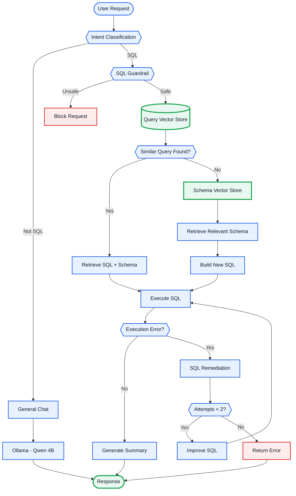

# 🤖 SQL AI Agent

An AI-powered SQL assistant that allows users to interact with databases using natural language.

Built with **LangGraph, Google Gemini, Ollama, Vector Stores, Flask, and Streamlit**.

## ⭐ Key Feature — Query Memory

The core optimization of this project is a **Query Vector Store** that stores information from previously processed requests:

```text
User Request
     +
Generated SQL Query
     +
Relevant Schema
```

For a new SQL request, the agent searches the Query Vector Store for a semantically similar request.

* **Similar query found** → Reuse the stored SQL and relevant schema
* **No suitable query** → Retrieve relevant schema and build a new SQL query

The retrieval threshold is **experimentally tuned based on workflow results** to improve retrieval accuracy.

This approach is designed to reduce unnecessary LLM calls and improve response time for repeated or similar requests.

## 📚 Schema Retrieval

A separate **Schema Vector Store** contains database schema information.

When a new SQL query needs to be generated, a retriever searches the Schema Vector Store and retrieves only the relevant tables and columns.

The retrieved schema is then passed to the SQL-generation prompt instead of sending the complete database schema to the LLM.

```text
User Request
     ↓
Schema Retriever
     ↓
Relevant Tables / Columns
     ↓
SQL Generation Prompt
     ↓
Generated SQL
```

## 🏗️ Workflow



## ✨ Features

* 🗄️ Query Vector Store for SQL memory
* 📚 Schema Vector Store for schema retrieval
* 🧠 Natural-language SQL generation
* 📊 Similarity-based query retrieval
* 📈 Experimentally tuned retrieval threshold
* 🛡️ Read-only SQL guardrails
* 🔧 Automatic SQL error remediation
* 🔁 Up to 2 SQL correction attempts
* 📝 Result summarization
* 🧵 Thread-based conversations
* 💬 Chat history
* 🦙 Ollama Qwen 4B for general chat
* 🤖 Google Gemini for SQL workflow

## 🔒 SQL Safety

SQL requests pass through a guardrail before execution.

The workflow is designed for **read-only database access** and blocks destructive operations such as:

```text
INSERT
UPDATE
DELETE
DROP
ALTER
TRUNCATE
```

## 🔧 SQL Remediation

If SQL execution fails, the generated query and database error are sent back to the LLM to generate an improved query.

The workflow allows up to **two remediation attempts**.

```text
SQL → Execute → Error
                 ↓
          SQL + Error → LLM
                 ↓
           Improved SQL
                 ↓
              Execute
```

## 🧵 Threading & Chat History

Each conversation has its own **thread**, allowing conversations to maintain independent context.

Chat history enables users to ask follow-up questions using previous conversation context.

## 🧩 Tech Stack

| Component        | Technology               |
| ---------------- | ------------------------ |
| Frontend         | Streamlit                |
| Backend          | Flask                    |
| Agent            | LangGraph                |
| General Chat     | Ollama / Qwen 4B         |
| SQL LLM          | Google Gemini            |
| Query Memory     | Vector Store             |
| Schema Retrieval | Vector Store + Retriever |
| Database         | SQL Database             |
| Language         | Python                   |

## ⚙️ Setup

```bash
git clone <YOUR_REPOSITORY_URL>
cd <PROJECT_DIRECTORY>

python -m venv venv
venv\Scripts\activate

pip install -r requirements.txt
```

Create a `.env` file with the required API and database credentials.

Install the Ollama model:

```bash
ollama pull qwen:4b
```

Start the backend:

```bash
python app.py
```

Start the frontend:

```bash
streamlit run streamlit_app.py
```

## 💡 Example

```text
User:
Show customers who placed orders above 1000.

        ↓

Query Vector Store
        ↓
Similar query found?
     ↙          ↘
   Yes           No
    ↓             ↓
Reuse SQL    Schema Retriever
    ↓             ↓
    └──────┬──────┘
           ↓
      Execute SQL
           ↓
      Generate Summary
           ↓
        Response
```

## 🚀 Future Improvements

* Systematic query-memory evaluation
* Better semantic validation before SQL reuse
* Improved schema retrieval
* Stronger SQL parsing and validation
* Database-level read-only permissions
* Query timeout and resource limits
* Support for multiple databases
* Improved SQL remediation

## 👨‍💻 Author

**Vardhan Reddy**

## 📝 Medium Article

I’m writing a detailed Medium article covering the architecture, design decisions, Query Vector Store, schema retrieval, SQL guardrails, remediation, threading, and the challenges faced while building this project.

**Coming soon.**