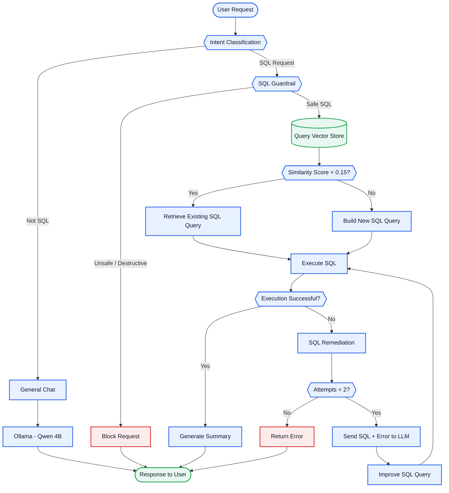

# 🤖 SQL AI Agent

An AI-powered SQL assistant that allows users to interact with a database using natural language.

The system intelligently determines whether a user request requires SQL or general conversation. SQL requests go through safety validation, query-memory retrieval, SQL generation, execution, automatic error remediation, and result summarization.

The application also supports **thread-based conversations and chat history**, allowing users to continue conversations while maintaining context.

---

## 🚀 Features

* 🧠 Natural-language SQL generation
* 🔀 SQL vs. General Chat classification
* 🛡️ SQL guardrails for read-only database access
* 🗄️ Query memory using a vector store
* ⚡ Reuse previously generated SQL queries
* 💰 Reduced LLM API usage and cost
* 🔧 Automatic SQL error remediation
* 🔁 Up to 2 SQL correction attempts
* 📝 Automatic result summarization
* 💬 General conversational chat using Ollama
* 🧵 Thread-based conversations
* 🕘 Chat history and contextual follow-up questions
* 🌐 Flask backend
* 🖥️ Streamlit frontend
* 🤖 LangGraph-based workflow

---

# 🏗️ Architecture



---

# 🔄 Workflow

## 1. User Request

The user enters a natural-language request through the Streamlit interface.

Example:

```text
Show all customers.
```

The request is sent to the Flask backend and passed into the LangGraph workflow.

---

## 2. Intent Classification

The first step determines whether the request requires database interaction.

The request is classified as either:

```text
sql_query
```

or

```text
not_sql_query
```

### General Chat

If the request does not require SQL, it is routed to the General Chat node.

General conversations are handled locally using:

```text
Ollama + Qwen 4B
```

Example:

```text
What is machine learning?
```

This request does not require database access, so it is handled by the general-chat model.

---

# 3. SQL Guardrail

If the request is classified as an SQL request, it first passes through the SQL guardrail.

The guardrail ensures that the SQL workflow only executes **safe, read-only queries**.

Queries that attempt to modify database structure or data are blocked.

Examples of blocked operations include:

```sql
INSERT
UPDATE
DELETE
DROP
ALTER
TRUNCATE
```

For example:

```text
Delete all customers.
```

will be blocked instead of being executed against the database.

---

# 4. Query Memory Vector Store

After the SQL request passes the guardrail, the system checks the **query vector store**.

The vector store contains previously processed:

```text
User Request → Generated SQL Query
```

For example:

```text
User Request:
Show all customers

Generated SQL:
SELECT * FROM customers;
```

When a new request arrives, the system searches the vector store for a semantically similar request.

This provides a query-memory mechanism that allows the system to reuse previously generated SQL queries.

---

# 5. Similarity Score

The system uses a similarity score threshold of:

```text
0.15
```

### Score < 0.15

If the similarity score is below `0.15`, the retrieved query is considered sufficiently similar.

The previously generated SQL query is reused and executed.

```text
User Request
     ↓
Vector Search
     ↓
Score < 0.15
     ↓
Retrieve Existing SQL
     ↓
Execute
```

### Score >= 0.15

If the similarity score is greater than or equal to `0.15`, the existing query is not reused.

Instead, a new SQL query is generated.

```text
User Request
     ↓
Vector Search
     ↓
Score >= 0.15
     ↓
Build New SQL
     ↓
Execute
```

This query-memory approach helps reduce unnecessary LLM calls and API costs.

---

# 6. SQL Query Generation

When a suitable query is not found in the vector store, the system generates a new SQL query.

The SQL workflow uses **Google Gemini** for the LLM-based SQL generation and related SQL processing.

The generated SQL is based on the user's request and the available database information.

Example:

```text
User:
Show all customers.
```

Generated SQL:

```sql
SELECT * FROM customers;
```

---

# 7. SQL Execution

Once the SQL query has been obtained, it is executed against the database.

If execution succeeds, the result is passed to the summarization stage.

If execution fails, the system starts the SQL remediation process.

---

# 8. SQL Remediation

LLMs can occasionally generate SQL queries that contain errors.

For example:

```text
Unknown column 'first_name'
```

Instead of immediately returning an error to the user, the system attempts to automatically correct the SQL.

The SQL remediation process sends information such as:

* Generated SQL query
* Database error
* Relevant context

back to the LLM.

The LLM generates an improved SQL query, which is then executed again.

```text
SQL Query
    ↓
Execute
    ↓
Error
    ↓
Send SQL + Error to LLM
    ↓
Generate Improved SQL
    ↓
Execute Again
```

The system allows up to **two remediation attempts**.

If the query still fails after the allowed attempts, the error is returned to the user.

---

# 9. Result Summarization

When SQL execution succeeds, the database result is passed to the summary stage.

Instead of returning raw database output, the system generates a natural-language response.

For example:

```text
Database Result:

customer_id | name
------------|-------
1           | John
2           | David
3           | Sarah
```

The user receives a concise response such as:

```text
There are 3 customers: John, David, and Sarah.
```

---

# 🧵 Threading

Each conversation is associated with a unique thread.

This keeps different conversations isolated from each other.

Conceptually:

```text
Thread A
 ├── User Request
 ├── AI Response
 ├── User Follow-up
 └── AI Response

Thread B
 ├── User Request
 └── AI Response
```

This allows multiple conversations to maintain their own context.

---

# 💬 Chat History

Chat history is maintained for each thread.

This allows users to ask follow-up questions using previous conversation context.

Example:

```text
User:
Show all customers.

AI:
There are 10 customers.

User:
Which of them placed orders?

AI:
...
```

The previous conversation is available when processing the follow-up request.

This makes the application conversational rather than a simple one-request/one-response SQL generator.

---

# 🧩 Technology Stack

| Component          | Technology       |
| ------------------ | ---------------- |
| Frontend           | Streamlit        |
| Backend            | Flask            |
| Agent Framework    | LangGraph        |
| General Chat Model | Ollama / Qwen 4B |
| SQL LLM            | Google Gemini    |
| Query Memory       | Vector Store     |
| Embeddings         | Embedding Model  |
| Database           | SQL Database     |
| Language           | Python           |

---

# 📁 Project Structure

```text
SQL-AI-Agent/
│
├── db/
│   └── Database-related functionality
│
├── graph/
│   └── LangGraph workflow and state
│
├── models/
│   └── Model and database-related functionality
│
├── nodes/
│   └── LangGraph workflow nodes
│
├── prompts/
│   └── SQL and agent prompts
│
├── rag/
│   └── Query memory and vector-store functionality
│
├── sql_scripts/
│   └── Database schema and SQL scripts
│
├── app.py
│   └── Flask backend
│
├── streamlit_app.py
│   └── Streamlit frontend
│
├── requirements.txt
│   └── Python dependencies
│
├── .gitignore
│
└── README.md
```

---

# ⚙️ Installation

## 1. Clone the Repository

```bash
git clone <YOUR_REPOSITORY_URL>
cd <YOUR_PROJECT_DIRECTORY>
```

## 2. Create a Virtual Environment

```bash
python -m venv venv
```

Activate the environment on Windows:

```bash
venv\Scripts\activate
```

## 3. Install Dependencies

```bash
pip install -r requirements.txt
```

---

# 🔐 Environment Variables

Create a `.env` file in the project root.

Example:

```env
GOOGLE_API_KEY=your_google_api_key

DATABASE_HOST=your_database_host
DATABASE_USER=your_database_user
DATABASE_PASSWORD=your_database_password
DATABASE_NAME=your_database_name
```

> **Important:** Never commit API keys, database credentials, or other secrets to GitHub.

The `.gitignore` file is configured to exclude environment files.

---

# 🦙 Ollama Setup

General chat uses the local:

```text
Qwen 4B
```

Install Ollama and pull the model:

```bash
ollama pull qwen:4b
```

Make sure Ollama is running before starting the application.

---

# ▶️ Running the Application

The application contains two main components:

* Flask backend
* Streamlit frontend

## Start Flask Backend

```bash
python app.py
```

## Start Streamlit Frontend

Open another terminal and run:

```bash
streamlit run streamlit_app.py
```

The Streamlit interface will be available at the URL displayed in the terminal.

---

# 💡 Example Queries

### SQL Queries

```text
Show all customers.
```

```text
Show all orders.
```

```text
Show each customer's orders.
```

```text
Which customer has the highest number of orders?
```

```text
What is the total order amount?
```

### General Chat

```text
What is artificial intelligence?
```

```text
Explain machine learning.
```

General questions are automatically routed to the Ollama Qwen 4B model.

---

# 💰 Query Memory Optimization

A key optimization in this project is the **query vector store**.

Without query memory:

```text
User Request
     ↓
LLM
     ↓
Generate SQL
     ↓
Execute
```

With query memory:

```text
User Request
     ↓
Query Vector Store
     ↓
Similar Query?
   ↙       ↘
 Yes       No
  ↓         ↓
Reuse SQL  Generate SQL
  ↓         ↓
  └────┬────┘
       ↓
    Execute
```

When a sufficiently similar query already exists, the system can reuse the stored SQL instead of generating a new query.

This helps:

* Reduce LLM API calls
* Reduce API costs
* Reduce latency
* Reuse previously generated SQL
* Improve efficiency for repeated or similar requests

---

# 🛡️ Safety

The SQL agent follows a read-only approach.

The guardrail prevents generated SQL from performing destructive database operations.

This provides an additional safety layer between the LLM and the database.

---

# 🔮 Future Improvements

* Improved semantic query matching
* Dynamic similarity thresholds
* Better schema retrieval
* Support for multiple databases
* Improved SQL validation
* More advanced SQL remediation
* Streaming responses
* Improved long-term conversation memory
* Authentication and user management
* Query performance monitoring
* Enhanced observability

---

# 👨‍💻 Author

**Vardhan Reddy**

Computer Science & Engineering

---

## ⭐ Project Overview

This project combines **LLMs, LangGraph, vector search, query memory, SQL generation, guardrails, SQL remediation, and conversational memory** to provide a natural-language interface for interacting with structured data.

The main objective is to make database interaction easier for users while maintaining **safety, reliability, conversational context, and reduced LLM/API costs**.
